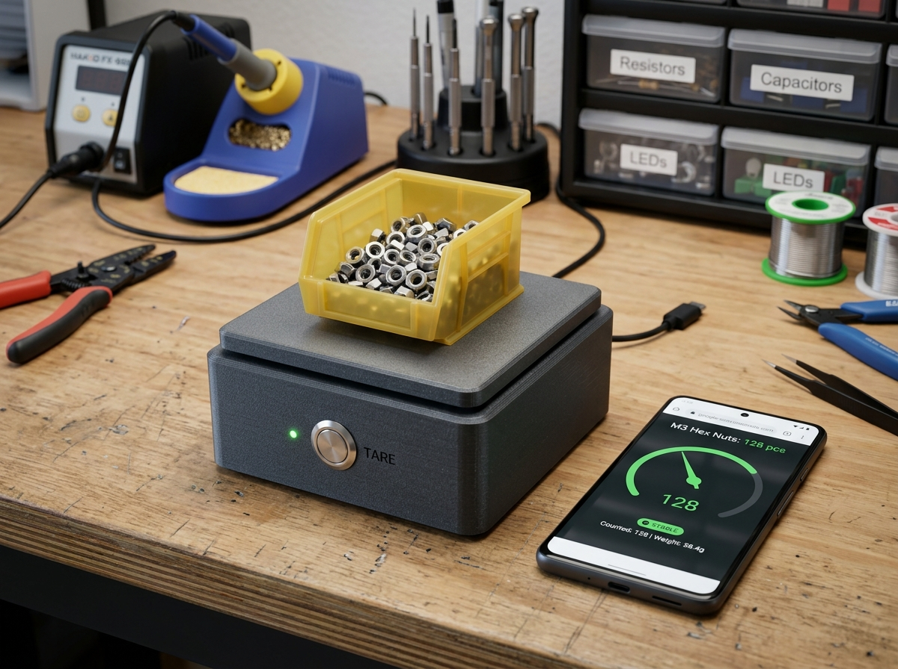

# Parts Tally

**Parts Tally is a USB-powered ESP32-C3 smart bin scale that counts small workshop parts by calibrated unit weight and serves a private local inventory app—no cloud account required.**



## Motivation

Counting screws, nuts, washers, crimp terminals, and other small repeated parts by hand is slow. Visual estimates are unreliable, while commercial inventory systems are often expensive or cloud-dependent. Parts Tally turns a removable parts bin into a local smart scale: select a saved part profile, tare the empty bin, and see an estimated count plus a low-stock state.

## Target users

- Home workshops and makerspaces
- Electronics benches with reels, connectors, and loose hardware
- Small repair shops that want a lightweight, account-free stock signal
- Hobbyists who need repeatable counts rather than purchasing automation

## Use cases

1. **Fast recount:** place a known bin on the platform, select its profile, and estimate count from net mass / calibrated unit mass.
2. **Low-stock check:** show green/amber/red locally against a user-defined threshold.
3. **Calibration:** weigh an empty bin, then a known sample (for example 20 washers) to derive unit mass.
4. **Portable records:** export profiles and count history as JSON or CSV from the local app.
5. **Manual correction:** override a noisy estimate and preserve an auditable correction without pretending the scale is exact.

## Intended workflow

1. Assemble the low-voltage load-cell platform and connect it by USB-C to a 5 V supply.
2. On first use, the device exposes a temporary local setup access point; the user configures Wi-Fi or continues in direct-device mode.
3. Open the phone-friendly local web app, create a part profile, tare the empty bin, and run a known-count calibration.
4. Place the loaded bin on the platform. The device filters readings, reports stability and uncertainty, then estimates count.
5. Review or correct the count, set a threshold, and export local data when desired.

## MVP

- ESP32-C3 controller with USB power, Wi-Fi, and BLE-capable hardware
- One 4-wire bar load cell and 24-bit bridge ADC (prototype candidate: HX711 breakout)
- Physical tare/calibrate button and RGB status indication
- Stable-weight detection, tare, multi-point known-count calibration, and count uncertainty
- On-device local API plus responsive installable PWA
- Local profile/history storage with JSON and CSV export/import
- Offline/direct-device mode after initial assets are loaded
- Reproducible firmware and app builds
- Editable KiCad schematic and custom carrier PCB after the module prototype is validated

## Non-goals

- Trade-certified weighing or legal-for-commerce measurements
- Medical, food-safety, life-safety, or unattended industrial process control
- Exact counting of mixed parts or parts whose unit mass varies substantially
- Mains wiring, battery charging in the first revision, or cloud accounts
- Automatic purchasing or supplier-stock claims

## Hardware at a glance

```text
5 V USB-C supply
       |
XIAO ESP32-C3 ---- status RGB LED
   |       |
   |       +------ tare/calibrate button
   |
   +-- 24-bit bridge ADC (HX711 candidate) -- 5 kg bar load cell
   |
   +-- local Wi-Fi HTTP/WebSocket API ------ phone/desktop PWA
```

Prototype target: approximately **USD $35–$55**, excluding a user-printed enclosure. This is a planning range, not a quote; current prices and availability must be re-verified before ordering.

## Safety limits

Parts Tally is a SELV/USB 5 V bench device. Do not connect it to mains, exceed the load cell's rated load, use it as a structural support, or rely on it for safety-critical stock decisions. Provide overload stops in the mechanical design. A printed enclosure must not carry loads through the PCB. This project is not a certified scale.

## Privacy, permissions, and storage

- No account, analytics, or cloud service is required.
- Profiles, calibration values, thresholds, and history are stored on the device and/or in browser-local storage as documented by the app implementation.
- Network access is limited to local device discovery/setup and the device API.
- BLE/Wi-Fi permissions are requested only when a chosen provisioning flow needs them.
- Export and import are explicit user actions; secrets are excluded from exports.
- Optional future integrations must remain opt-in and preserve a useful offline mode.

## Source-of-truth policy

Final BOM data belongs in **KiCad schematic symbol properties** (`Manufacturer`, `MPN`, supplier fields, and BOM notes) and is exported to `bom/bom.csv`. `bom/preliminary-bom.csv` is only a planning document and must not drift into a competing source of truth.

The hardware release will contain real editable KiCad sources—not image-only drawings—including:

- `hardware/kicad/parts-tally.kicad_pro`
- `hardware/kicad/parts-tally.kicad_sch`
- `hardware/kicad/parts-tally.kicad_pcb`

Those files do not exist yet and will be created only when the schematic issue is implemented with real ERC/DRC evidence.

## Current status and milestones

1. Requirements, measurement model, and architecture risk review — baselined in the editable documents below; this is documentation/static evidence only
2. Datasheet-backed module prototype and calibration fixture
3. Editable KiCad schematic, ERC, and schematic-backed BOM
4. Firmware and local protocol with host-side tests
5. Accessible local PWA and import/export
6. Carrier PCB, DRC, assembly/bring-up, and fabrication release

Baseline contracts:

- [System architecture and count/uncertainty model](docs/architecture.md)
- [Reviewed measurable requirements](hardware/requirements.md)
- [Planned module wiring and carrier boundary](hardware/interfaces.md)
- [Unexecuted prototype verification plan](docs/verification-plan.md)
- [Risk register](docs/risk-register.md)
- [Machine-readable architecture contract](docs/architecture-contract.json)

Run `python3 scripts/validate_contract.py` and `python3 -m unittest discover -s tests -v` to validate document, safety, dependency, risk, and evidence-state consistency.

See [PLAN.md](PLAN.md), [hardware/README.md](hardware/README.md), and the GitHub issue backlog.

## Development quickstart

The implementation toolchains will be pinned in the first project-skeleton issue. The intended commands are:

```bash
# Firmware (PlatformIO)
cd firmware
pio run
pio test -e native

# Companion PWA (TypeScript/Vite)
cd app
npm ci
npm test
npm run build
```

These commands are targets, not current passing evidence; the corresponding projects have not yet been scaffolded.

## Contributing

Keep changes issue-scoped and evidence-backed. Never report physical bench testing unless a real assembled prototype and procedure were used; distinguish static analysis, simulation, firmware/app tests, and physical measurements.
